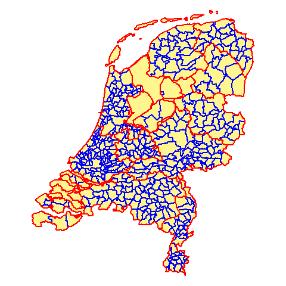
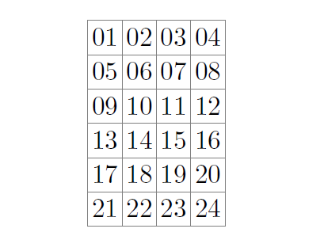
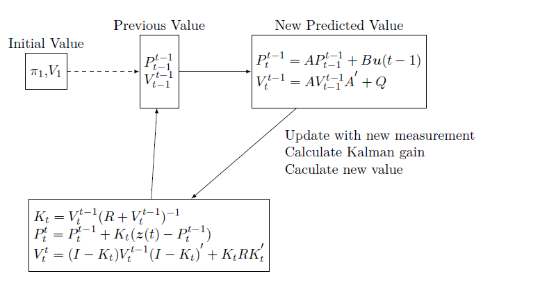
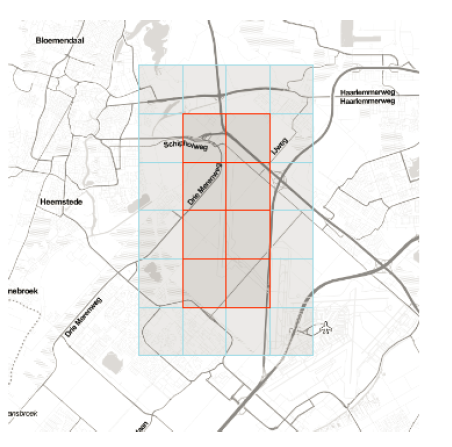
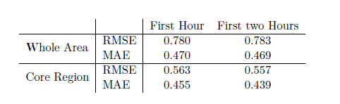
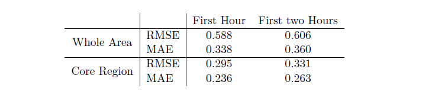

```{r setup, include=FALSE}
knitr::opts_chunk$set(echo = FALSE)
library(reshape2)
library(plyr)
library(ggmap)
map <- qmap("2141CN",zoom = 12,maptype="toner-lite")

```


## Outline 

* Preliminary
* Spatial Kalman Filter Model 
    + Inference 
    + Learning
* Real Data Example (Case in Schiphol)
* Conclusion & Future Work

## Outline 

* Preliminary
* <div class="gray">Spatial Kalman Filter Model </div>
    + <div class="gray">Inference </div>
    + <div class="gray">Learning</div>
* <div class="gray">Real Data Example (Case in Schiphol)</div>
* <div class="gray"> Conclusion & Future Work</div>


##Preliminary


* Kalman Filter Model
    + Description 
    + Simple system model in Mathematical Form
* Spatial-Temporal Data
    + Spatial Characteristics
    + Time Characteristics

##Kalman Filter


* Assume that results of experiment are noisy 
* Model of how system evolves
* Optimal combination of system model and observations
* Prediction / correction framework


##Simplest System Model

<div class="centered">

 $y_t = ay_{t-1}  + w_{t-1}$ 

 $z_t = y_t + v_t$ 
 
 where $w_{t-1} \sim N(0, q)$ 
 
 and $v_{t} \sim N(0, r)$

</div>


##Model Extensions


* Input control features

* Incorporate Spatial-Temporal Data


##Spatial-Temporal Data


* Time Characteristics
    + Temporal Data varies over time.


* Spatial Characteristics 
    + Spatial Data can be areal units or points in space.


* Spatial-Temporal Data has both characteristic


##One example of areal units


<center></center>

##The areal grid units in thesis


<center></center>


##Neighbourhood assumption


<center></center>


## Outline 

* <div class="gray">Preliminary</div>
* Spatial Kalman Filter Model
    + Inference
    + Learning
* <div class="gray">Real Data Example (Case in Schiphol)</div>
* <div class="gray"> Conclusion & Future Work</div>


##Spatial Kalman filter model 

<div class="centered">

$y(t) = Ay(t-1) + Bu(t-1) + w_{t-1}$

$z(t) = y(t) + v_t$

$w_{t-1} \sim N(0, Q)$

$v_ {t}  \sim N(0, R)$

</div>

##Spatial Kalman filter model 

<div class="centered"> $z(t) = y(t) + v_t$ </div>

<br />


* $y(t)$ and $z(t)$ are vectors containing all locations in $l\times m$ grid


$$
\begin{gather*}
y(t) 
  = \begin{bmatrix}
    y(t,(1,1))  \\
    \vdots        \\
    y(t,(l,m))
    \end{bmatrix}
\end{gather*}
$$

$$
\begin{gather*}
z(t) 
  = \begin{bmatrix}
    z(t,(1,1))  \\
    \vdots        \\
    z(t,(l,m))
    \end{bmatrix}
\end{gather*}
$$

##Spatial Kalman filter model 

<div class="centered"> $y(t) = Ay(t-1) + Bu(t-1) + w_{t-1}$ </div>

<br />

* $u(t)$ is a vector containing all locations and all input control features

$$
\begin{gather*}
u(t) = \begin{bmatrix}
    u_1(t,(1,1))  \\
    u_1(t,(1,2))  \\
    \vdots        \\
    u_n(t,(1,1))  \\
    \vdots        \\
    u_n(t,(l,m))
\end{bmatrix}
\end{gather*}
$$

##Spatial Kalman filter model 

<div class="centered"> $y(t) = Ay(t-1) + Bu(t-1) + w_{t-1}$ </div>

<br />

* matrix A and matrix B contains spatial assumption

* They are sparse matrices meeting the neighbourhood assumption


##Spatial Kalman filter model 


* example rows in matrix $A =(\vec{a_{01}},\dots,\vec{a_{24}})^T$

<br />

$$
\begin{gather*}
\vec{a_{03}} = (0,a_{0302},a_{0303},a_{0304},0,\\a_{0306},a_{0307},a_{0308}, \underbrace{0,\dots,0}_{16})\\
\vec{a_{14}} = (\underbrace{0,\dots,0}_{8},a_{1409},a_{1410},a_{1411},0,\\a_{1413},a_{1414},a_{1415},0,a_{1417},a_{1418},a_{1419}, \underbrace{0,\dots,0}_{5})\\
\end{gather*}
$$


##Spatial Kalman filter model 


* example for matrix B

<br />

$$
\begin{gather*}
B = \begin{bmatrix} 
           B_1 & B_2 & \dots 
    \end{bmatrix} 
\end{gather*} 
$$

* each submatrix in matrix B has the same structure as matrix A


##Inference in Spatial Kalman filter


* Kalman Filter
    + Given past and current observations 
    + Forward process
* Kalman Smoothing
    + Given all observations
    + Backward process
    
    
##Kalman Filter


* $P_t^{t^\ast}$ is the expected state vector at time $t$ given the observations vector and input variables from time one to time $t^\ast$. 

* $V_t^{t^\ast}$ refers to the state variance matrix at time $t$ given the observations vector and input variables from time one to time $t^\ast$.

* Kalman Gain $K_t$ Weighting of process model vs. measurements


##Kalman Filter


<center></center>


##Kalman Smoother


* Include all available measurements

* Backward pass

* $V_{t+1,t}^T$ is the covariance of the joint posterior distribution of all the states given all the measurements and input variables 


##Kalman Smoother

```{r out.width = '100%', fig.align = "center"}
library(png)
library(grid)
img <- readPNG("images/smoother.png")
grid.raster(img)
```


##Learning in Spatial Kalman filter model 


* Standard Expectation Maximization 
    + non-sparse matrices will be found

* Greedy Expectation Maximization
    + estimate each row of matrix to respect the assumption

##Greedy Expectation Maximization 


1. Give initial value A,B,Q,R to start the algorithm
2. Implement the Kalman recursion given A,B,Q,R and $z_{1:T}$ to calculate the required quantities $E[y(t)|z_{1:T}]$, $E[y(t)y(t-1)^{'}|z_{1:T}]$ and $E[y(t)y(t)^{'}|z_{1:T}]$.
3. Maximize the expected log likelihood $\Phi$ to find the updated new value of each row in A, each row in B,Q,R and row wise concatenation for A and B
4. Check the convergence criteria of the likelihood $\Phi$, repeat the step (2) and step (3) until it has converged.


##Respect the sparse structure in matrix A and matrix B


* indicator matrix for each row
* indicator matrix is diagonal
* entries of diagonal in indicator matrix follow spatial assumption
* Each row vector times corrsponding indicator matrix to respect the strucutre

##Respect the sparse structure in matrix A and matrix B

* Example of diagonal entries in the indicator matrix $J_s$ for the 3rd row of A

$$
\begin{gather*}
diag({a_{03}}) = diag(0,1,1,1,0,1,1,1, \underbrace{0,\dots,0}_{16})\\
\end{gather*}
$$

* Example of diagonal entries in the indicator matrix for the 14th row of A

$$
\begin{gather*}
diag({a_{14}}) = diag(\underbrace{0,\dots,0}_{8},1,1,1,0,1,1,1,0,1,1,1, \underbrace{0,\dots,0}_{5})\\
\end{gather*}
$$


##Update equations for parameters


* only matrix A and matrix B using greedy algorithm

* No order requirements between A and B

* Evaluate A and B first, then Q and R


##Update equations for A 

* Example  without input control variables

      + Greedy Algorithm 
     
$$
\begin{gather*}
\vec{a_{s}} = (\sum_{t=2}^{T}E[{y}({t,s}){y}({t-1})^{'}])(J_s\sum_{t=2}^{T}E[{y}({t-1}){y}({t-1})^{'}])^{-1}
\end{gather*}
$$

</br>
<p></p>  + Standard Algorithm 


$$
\begin{gather*}
A = (\sum_{t=2}^{T}E[{y}({t}){y}({t-1})^{'}])(\sum_{t=2}^{T}E[{y}({t-1}){y}({t-1})^{'}])^{-1}
\end{gather*}
$$


##Update equations for others

* Equations for B
    
     + Indicator matrix in the denominator 


* Equations for others are same with those in Standard algorithm


##Properties of Sparse Kalman Model


* Initialization Sensitivity
* Numerical Instability
* Maximum Likelihood non-Monotonicity


##Initialization Sensitivity

In Standard algorithm

* EM algorithm converges to a stationary point 
    + not necessarily to the maximum likelihood estimator 
    + or even to a local maximum
* Kalman filter affect the convergence rate 


In Greedy algorithm

* EM algorithm only approximate to a stationary point 
    
* Kalman filter affect the convergence rate 

##Initialization in limited iterations


* prior information for where to initialize the algorithm is important
    + converge quickly
    + close to local maximum
    + model meaningful and reasonable
  
##Numerical Instability & Mathematical Issue

* Matrix should be Positive-definite and invertible
    + rounding issues
    + basic arithmetic in matrices
    
    
* Estimation is non-identifiable and have multiple solutions


##Numerical Instability & Mathematical Issue Solution 


* return a positive definite and well-conditioned covariance matrix
    + duplicate lower triangular matrix
    + James-Stein-type shrinkage estimator
    + sum calculation
  
* Moore–Penrose pseudo-inverse


##Maximum Likelihood non-Monotonicity


```{r out.width = '100%', fig.align = "center"}
library(png)
library(grid)
img <- readPNG("images/likelihood.png")
grid.raster(img)
```


## Outline 

* <div class="gray">Preliminary</div>
* <div class="gray">Spatial Kalman Filter Model </div>
    + <div class="gray">Inference </div>
    + <div class="gray">Learning</div>
* Real Data Example (Case in Schiphol)
* <div class="gray"> Conclusion & Future Work</div>


##Application in Schiphol case


* Data source
    + RobinRadar
    + Air Traffic Control the Netherlands
    + 10:00 to 12:00 on 7th April 2016 and 8th April 2016 in 24 cells
* Aim
    + Predict the mass density in certain area


##Application in Schiphol case


<center></center> 


##Application in Schiphol case


* Feature reduction
    + PCA 
    + Achieve more than 90% of the total variance of data set.

* Features
    + longitude, latitude, heading, mass correction and velocity
  

##Application in Schiphol case


* test multiple initial values
* performance review metrics
    + Loglikelihood
    + RMSE & MAE
  
##Application in Schiphol case


* test multiple initial values
* performance review metrics
    + Loglikelihood
    + RMSE & MAE
  

##Application in Schiphol case

* Performance when initialized from best RMSE metric

<center></center> 


##Application in Schiphol case

```{r eruptions,echo = FALSE}
inputPanel(
sliderInput("Times",
               "Choose times on 8th April 2016:",
                min = strptime("2016-04-08 10:01:00","%Y-%m-%d %H:%M"),
                max = strptime("2016-04-08 10:59:00","%Y-%m-%d %H:%M"),
                value=c(strptime("2016-04-08 10:01:00","%Y-%m-%d %H:%M")),timeFormat="%a %H:%M",ticks = F, animate = animationOptions(interval=2400, loop=TRUE),step = 60)
)

renderPlot({
  plot <- read.csv("plotdata.csv",header = TRUE)
  plot$time <- as.POSIXct(plot$time,format='%Y-%m-%d %H:%M')
  subplot <- plot[plot$time==input$Times,]
  map + geom_tile(data = subplot, aes(x = x, y = y, fill = value)) + scale_fill_gradient(low="white",high="blue",limit=c(0,3))
      
  
      })


```


##Application in Schiphol case

* Lasso gets better prediction ability
<center></center>


##Application in Schiphol case

* The number of parameters is dramatically increasing when each parameter matrix is a spatial correlation map
     + some of parameters can be punished

* Extreme value prediction


## Outline 

* <div class="gray">Preliminary</div>
* <div class="gray">Spatial Kalman Filter Model </div>
    + <div class="gray">Inference </div>
    + <div class="gray">Learning</div>
* <div class="gray">Real Data Example (Case in Schiphol)</div>
* Summary & Future Work


##Summary

* Combine time dependence with spatial dependence in one stage

* Substitute spatial assumption relation for physics relation in Kalman Model
    
    + increase parameters

* Greedy EM algorithm to respect the spatial assumption
    
    + Only approximate stationary point 

##Future work

*  Reduce parameters
      + Penalty function
      + more prior information
      
*  Other advanced Kalman filter


## Contact Info

* Personal Website

      + www.gubingjing.com
      
* Github 
     
      + github.com/sangaj
      
      
* Business

      + www.lekkertrip.com


